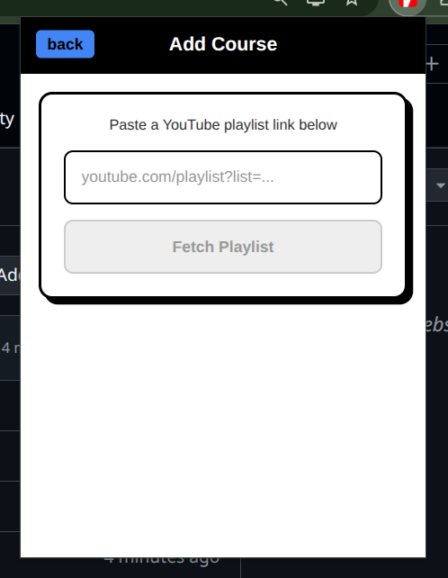
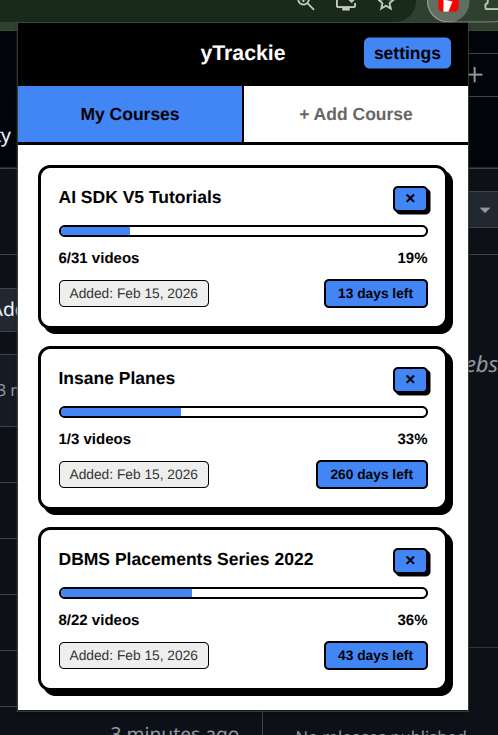
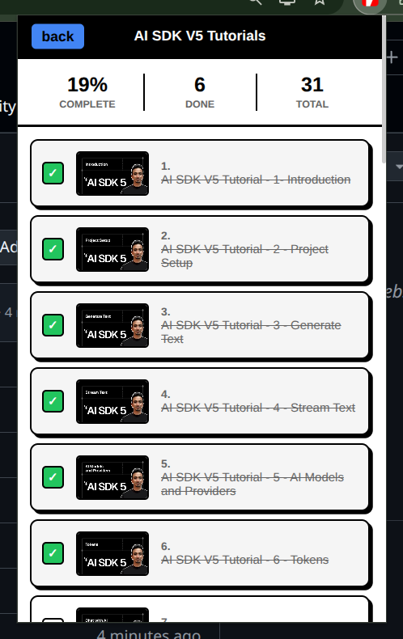

# yTrackie - A YouTube Course Tracker

A Chrome extension to track your YouTube playlist-based courses and monitor your learning progress.

## Screenshots
<p align="center">
  
  
  
</p>

## Features

- Add YouTube playlists as courses
- Track video completion with checkboxes
- View progress percentage for each course
- Set target completion dates
- Clean, minimalist neo-brutalism UI design

## Prerequisites

- Node.js installed
- A YouTube Data API key (free from Google Cloud Console)

## Getting a YouTube API Key

1. Go to [Google Cloud Console](https://console.cloud.google.com/)
2. Create a new project
3. Navigate to "APIs & Services" > "Library"
4. Search for and enable "YouTube Data API v3"
5. Go to "APIs & Services" > "Credentials"
6. Click "Create Credentials" > "API Key"
7. Copy your API key

## Installation from Source

### 1. Clone the Repository

```bash
git clone https://github.com/your-username/youtube-course-tracker.git
cd youtube-course-tracker
```

### 2. Install Dependencies

```bash
npm install
```

### 3. Build the Extension

```bash
npm run build
```

### 4. Load in Chrome

1. Open Chrome and navigate to `chrome://extensions/`
2. Enable "Developer mode" (toggle in top right)
3. Click "Load unpacked"
4. Select the `dist` folder from the project directory

### 5. Configure the Extension

1. Click the extension icon in Chrome
2. Click the settings icon in the top right
3. Paste your YouTube API key
4. Click "Save"

## Usage

### Adding a Course

1. Click "+ Add Course" tab
2. Paste a YouTube playlist URL (e.g., `https://www.youtube.com/playlist?list=PL...`)
3. Click "Fetch Playlist"
4. Review the course details and click "Add Course"

### Tracking Progress

1. Click on any course card to view all videos
2. Click on a video to mark it as complete
3. The progress bar updates automatically

### Setting Target Dates

1. Click "+ Set Target" on any course card
2. Enter a target date in YYYY-MM-DD format
3. The extension shows days remaining or overdue status

## Project Structure

```
.
├── src/
│   ├── App.jsx       # Main React component
│   ├── App.css       # Styles
│   └── content.js    # Chrome content script
├── public/
│   ├── manifest.json # Chrome extension manifest
│   └── icon*.png    # Extension icons
├── dist/             # Built extension files
└── package.json
```

## Tech Stack

- React
- Vite
- Chrome Extension API
- YouTube Data API v3

## License

MIT
